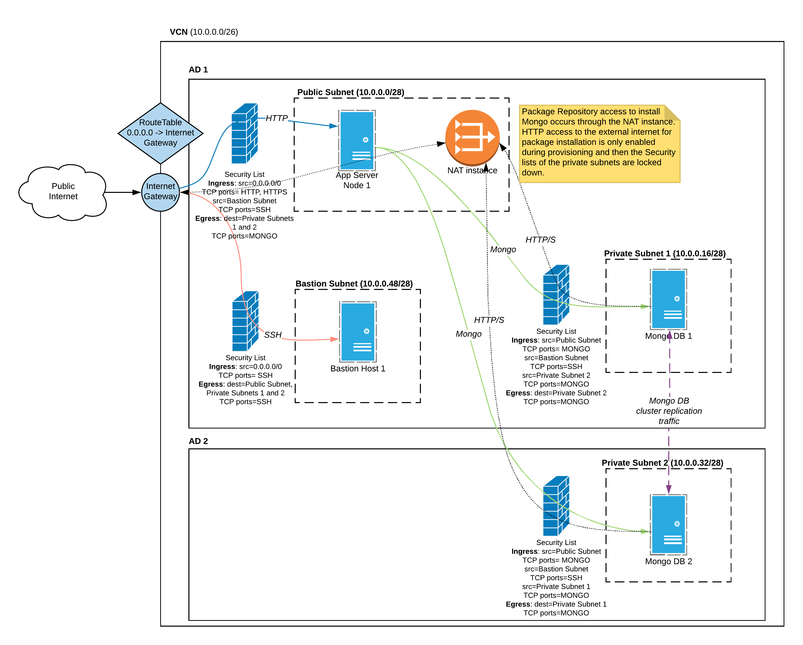

# Secure MongoDB Deployment in OCI Using Ansible

This sample shows how MongoDB could be deployed in a secure manner in
OCI using OCI Ansible cloud modules. It implements the Castle 
(defense in depth) strategy outlined in 
https://blogs.oracle.com/cloud-infrastructure/secure-mongodb-on-oracle-bare-metal-cloud-services

The sample ensures that security of the MongoDB installation is not compromised
by implementing several layers of defense:
- VCNs
- Public and Private Subnets
- Different users and groups for the various tiers. Use IAM policies to
    enforce AZN policies
- Secure compute instances - no ssh access in all the private and public
    subnet nodes
- Access control to Block Volumes, Encrypted Block volumes and volume
    backups
- Administrative access only through a Bastion host
    - On-demand SSH access (whitelisting of Admin IPs)

A graphic that depicts the network topology and the interaction of the
various OCI Services and resources used in this sample is shown below


## How to run the sample

- Install pre-requisites for OCI ansible modules
- Install OCI Ansible modules
- Ensure that you have a valid OCI SDK configuration at the default config path ~/.oci/config
- Export the following environment variables specific to your tenancy:
  SAMPLE_COMPARTMENT_OCID
  SAMPLE_OL_IMAGE_OCID
  SAMPLE_AD1_NAME
  SAMPLE_AD2_NAME
- Run the demo playbook to create the Secure MongoDB topology in OCI
> $ ansible-playbook sample.yaml
- Access the web-server in the AS tier
> `http://\<as1-ip\>`
- To teardown the whole setup using dynamic inventory, use
```sh
$ OCI_HOSTNAME_FORMAT="private_ip" OCI_CACHE_MAX_AGE=0 ansible-playbook -i <path-to-inventory-file>/oci_inventory.py demo_teardown_using_inventory.yaml
```
